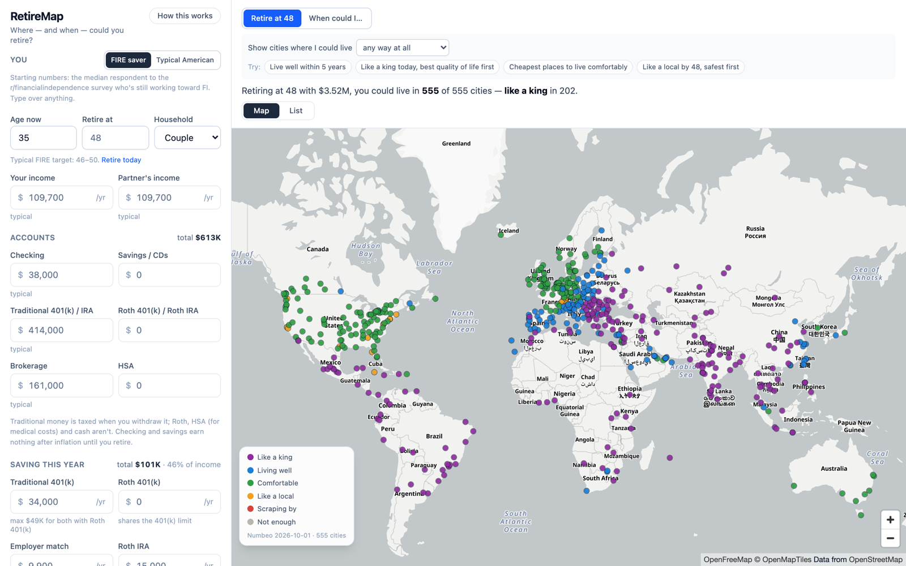
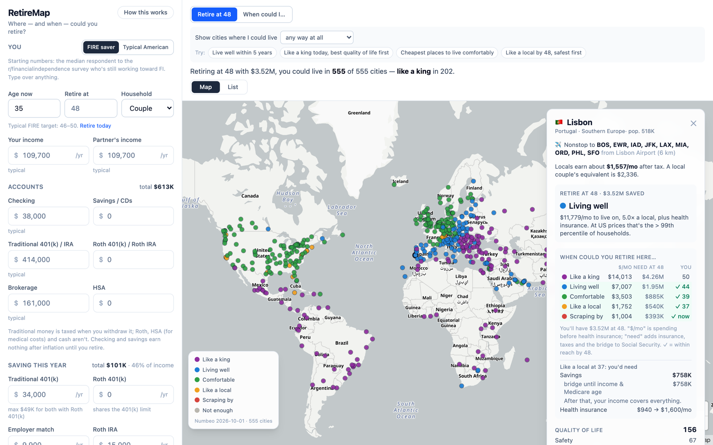
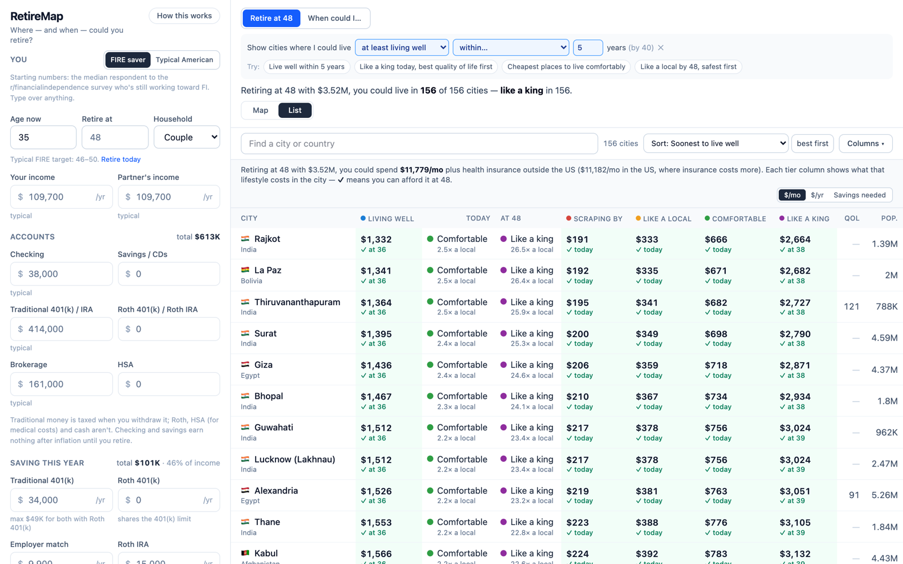
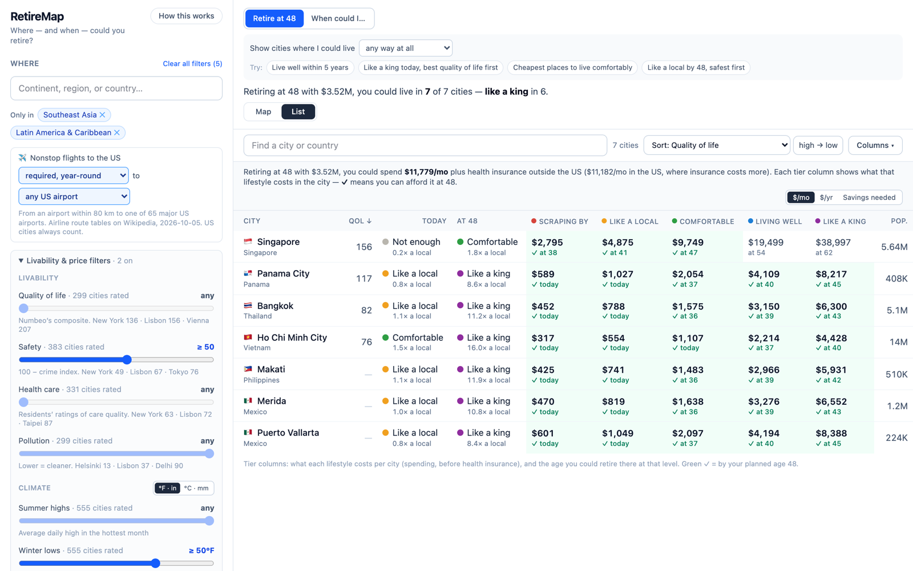
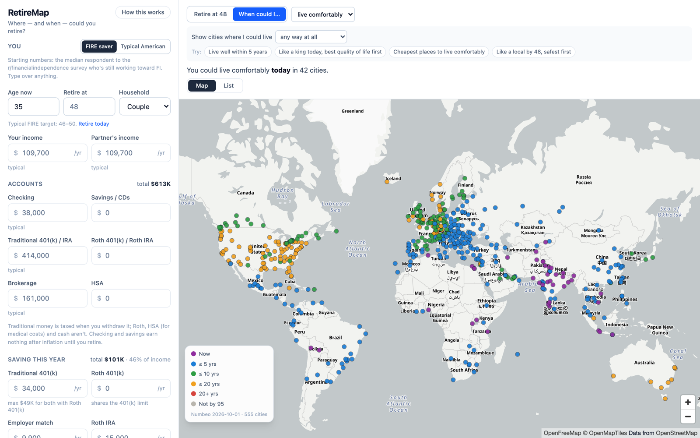
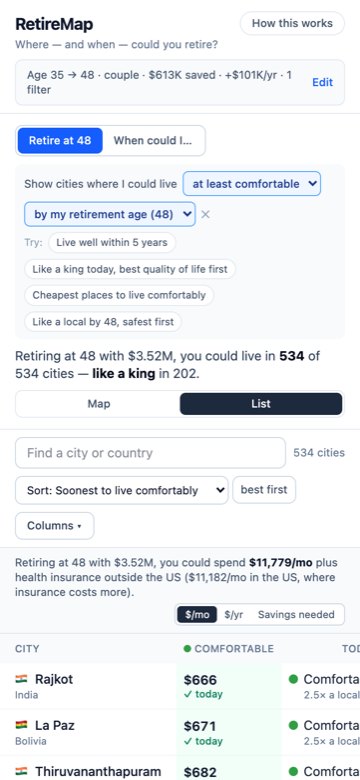

# RetireMap 🌍

**Where — and when — could you retire, and how well?** RetireMap takes your
real situation — age, income, account balances, what you save each year,
Social Security — and rates **555 cities worldwide** by the lifestyle you
could afford there, measured against what *locals* earn. Then it tells you
*when* you could retire in each one at each level.

**Live:** <https://retiremap-ej.web.app>



## What it does

- **Lifestyle tiers relative to locals** — from *Scraping by* to *Like a
  king*, by how your monthly budget compares with a local's take-home pay:

  | Tier | Your spend vs. the local reference |
  |---|---|
  | Not enough | < 0.43× (below a minimum-wage local — OECD median) |
  | Scraping by | 0.43–0.75× |
  | Like a local | 0.75–1.5× |
  | Comfortable | 1.5–3× |
  | Living well | 3–6× |
  | Like a king | ≥ 6× |

- **Two questions** — *Retire at [age]*: what tier your projected savings buy
  in each city. *When could I…*: pick a tier, see the age you could retire
  there at it.
- **Every city's price for every tier** — $/month, $/year, or the savings
  you'd need — with a ✓ where it's within reach by your planned age.
- **Real retirement math** — per-account balances and contributions
  (traditional/Roth 401(k), Roth IRA, HSA, brokerage, cash) with 2026 IRS
  limits and catch-ups, a blended withdrawal tax, Social Security from your
  income via SSA's formula, health insurance abroad vs. ACA/Medicare, and a
  safe withdrawal rate from 150 years of US market history that shrinks as
  your retirement gets longer.
- **Filter it down to what you care about** — only/never any continent,
  region (Southeast Asia, Central America…), group (EU, Middle East) or
  country; nonstop flights to the US (or to *your* airport); safety, health
  care, pollution, quality of life; summer highs, winter lows, sunshine,
  rain and humidity; rent and grocery prices; city size.
- **Data-backed defaults** — start as the median *FIRE saver* (from the
  r/financialindependence survey) or a *typical American* (Fed, Census,
  Vanguard, Gallup); every number is cited on the in-app *How this works*
  page.
- **Private and shareable** — everything runs in your browser; your plan is
  remembered locally and mirrored to the URL so you can share it.

| | |
|---|---|
|  |  |
| **City card** — nonstop flights, what each tier costs, the savings you'd need, and when you'd get there. | **"Live well within 5 years"** — one click on a worked question; every tier's price per city. |
|  |  |
| **Filters** — regions, flights, safety, climate in °F or °C, prices. | **When could I…** — colored by how many years until you could retire there comfortably. |

<p align="center"></p>

Built with Svelte 5, Vite, TypeScript, Tailwind v4 and MapLibre GL. No
backend, no accounts, no tracking — a full recompute of all 555 cities takes
~7 ms in the browser.

## Data sources

| What | Source | License |
|---|---|---|
| Cost of living, rent, salaries, quality of life, safety, health care | [Numbeo](https://www.numbeo.com/) (snapshot 2026-10-01) | Free for personal use with attribution; **not redistributable** as a dataset |
| City coordinates & populations | [GeoNames](https://www.geonames.org/) | CC BY 4.0 |
| Regions | [UN M49](https://unstats.un.org/unsd/methodology/m49/overview/) | Public |
| Climate | [Open-Meteo](https://open-meteo.com/) Historical Weather API (ERA5) | CC BY 4.0 |
| Sunshine calibration | WMO 1991–2020 station normals via NOAA NCEI + national met services | Public |
| Nonstop flights | Wikipedia "Airlines and destinations" tables; Wikidata | CC BY-SA 4.0 / CC0 |
| Market history (withdrawal rates, returns) | Robert Shiller; FRED GS10 | Public |
| Defaults | Federal Reserve SCF, Vanguard, Census, SSA, IRS, KFF, CMS, OECD, Gallup, r/financialindependence | Cited in `src/data/defaults.json` |
| Basemap | [OpenFreeMap](https://openfreemap.org), © OpenMapTiles, © OpenStreetMap | ODbL |

> **About the Numbeo data.** Cost-of-living, rent, salary, quality-of-life,
> safety and health-care figures in this repo (`src/data/cities.json`,
> `pipeline/salary-anchor.json`) come from [Numbeo.com](https://www.numbeo.com/)
> and remain © Numbeo. RetireMap is a free, non-commercial personal project
> using them under Numbeo's personal-use terms, with attribution. They are
> **not** licensed for reuse from this repository — if you want Numbeo data,
> get it from [Numbeo](https://www.numbeo.com/) under their
> [terms](https://www.numbeo.com/common/terms_of_use.jsp).

## Develop

Node 20+. The app builds from committed snapshots in `src/data/`; you only
need the pipeline (below) to refresh them.

```sh
npm install
npm run dev        # dev server
npm test           # vitest: SWR parity, planner, tiers, URL state, pipeline
npm run check      # svelte-check + tsc
npm run build      # production build to dist/
npm run deploy     # build + firebase deploy --only hosting (project retiremap-ej)
npm run screenshots  # regenerate docs/screenshots/*.png (needs the dev server + Chrome)
```

## The model (all real, today's dollars)

- **Local reference** = max(average monthly net salary, one person's non-rent
  costs). Numbeo defines Local Purchasing Power as salary ÷ cost of a
  COL-plus-rent basket relative to NYC, so
  `salary = NYC salary × k × PP/100 × colRent/100`; `k` is the median ratio
  against hand-read published salaries (`pipeline/salary-anchor.json`,
  ~1% mean error). Non-rent basics scale with the COL index the same way
  (~5%). The floor matters where pay doesn't cover the basket (Damascus,
  Lagos, Accra…).
- **Tier** = spend ÷ OECD-equivalent adults (couple = 1.5) ÷ local reference.
- **Savings needed** to retire at age A (`src/lib/math/plan.ts`):
  - perpetual part: long-run gap (spend + health − Social Security − other
    income, grossed up for tax) ÷ SWR(plan-to age − A);
  - bridge: extra shortfall before income starts / before 65, discounted at
    the historical real 10-year Treasury return (a bond ladder).
- **SWR(horizon)** (`src/lib/math/swr.ts`): port of the
  trinity-study engine — the highest rate that failed in ≤ X% of overlapping
  monthly US cohorts since 1871 (Shiller stocks, 10-yr Treasuries),
  pinned to the Python reference by `swr.test.ts`. Made non-increasing in
  horizon (the raw 5th percentile turns up past ~57 years as the 1960s–70s
  cohorts drop out).
- **Accounts**: invested accounts grow at the historical real CAGR of the
  stock/bond mix, checking/savings at 0% real.
- **Contributions** (`yearContribution` in `plan.ts`): this year's amount per
  account (traditional 401(k), Roth 401(k), employer match, Roth IRA, HSA,
  brokerage, cash), raised each year by real wage growth (SSA Trustees 2026:
  1.76%/yr), capped by the 2026 IRS limits — flat in real terms since they're
  inflation-indexed — with catch-ups at 50/55/60–63; per-adult 401(k)/IRA
  limits, family HSA limit; anything over a cap spills into brokerage.
  Defaults are the persona's share of income, clipped to the caps.
- **Social Security** (`socialSecurity.ts`): SSA's formula on your income(s) —
  taxable max $184,500, 35-year average (zero years before you start and after
  you retire), 90/32/15% bend points ($1,286 / $7,749), early/delayed claiming
  factors, spousal 50%. Typing a benefit overrides it. Withdrawals are pro rata, so the tax gross-up is a
  balance-weighted blend (401(k)/IRA rate, brokerage rate, 0 for Roth/cash).
- **When**: per city and tier, the first year the projection covers the need.
- **Health**: per person, outside the US international-plan broker quotes
  ($470 <65 / $800 65+); US ACA full price ($1,330) / Medicare + Medigap + Part
  D ($430).
- **Climate** (`pipeline/fetch-climate.ts`, `build-climate.ts`): Open-Meteo
  daily ERA5 weather → monthly normals → summer high (hottest month), winter
  low (coldest month), rain, rainy days, humidity. Sunshine is calibrated
  against 17 measured station normals (`pipeline/sunshine-reference.json`)
  by least squares on model sunshine + rainy days (leave-one-out error
  ~330 h mean / ~190 h median, vs ~930 h uncalibrated).
- **Flights** (`pipeline/fetch-flights.ts`, `build-flights.ts`): nonstops from
  any airport within 80 km of a city to the 65 FAA large/medium US hubs,
  from Wikipedia's "Airlines and destinations" tables; domestic US airports
  (by Wikidata country) are excluded so border cities don't inherit US
  domestic routes.
- The detail card also shows the old RetireMap readout: the cost-adjusted
  percentile of US household spending (BLS CE deciles, PCHIP).

## Refreshing the data snapshot

The app builds from committed JSON in `src/data/`, produced by
`npm run pipeline` from raw files in `pipeline/raw/` (gitignored). Refresh
once or twice a year:

1. **Numbeo tables** (manual — Numbeo's ToS prohibits automated scraping):
   - <https://www.numbeo.com/cost-of-living/rankings_current.jsp> →
     `pipeline/raw/numbeo.csv` (columns: Rank, City, Cost of Living Index,
     Rent Index, Cost of Living Plus Rent Index, Groceries Index, Restaurant
     Price Index, Local Purchasing Power Index).
   - <https://www.numbeo.com/quality-of-life/rankings_current.jsp> →
     `pipeline/raw/numbeo-qol.csv` (Rank, City, Quality of Life Index,
     Safety Index, Health Care Index, Pollution Index, Climate Index).
   - Per-topic rankings (each widens coverage beyond the QoL table), saved as
     `name|index` lines: <https://www.numbeo.com/crime/rankings_current.jsp>
     → `pipeline/raw/numbeo-crime.psv` (Safety Index column);
     <https://www.numbeo.com/health-care/rankings_current.jsp> →
     `pipeline/raw/numbeo-health.psv` (Health Care Index). Optional — the
     pipeline falls back to the QoL table's copies.
   - ⚠️ Numbeo's free tier has a **monthly page limit** (hit on 2026-10-01
     after ~35 page views; resets on the 1st). Budget a refresh: the two
     rankings tables + the per-topic tables + ~12 city pages for the anchors.
     Pollution, traffic and property tables weren't captured for that reason.
2. **Salary & basics anchors** — open NYC and the validation cities in
   `pipeline/salary-anchor.json` on Numbeo (display currency USD) and update
   "Average Monthly Net Salary (After Tax)" and "estimated monthly costs for a
   single person … excluding rent", plus the date.
3. **GeoNames** (only if new cities fail to match):
   ```sh
   curl -so pipeline/raw/cities15000.zip https://download.geonames.org/export/dump/cities15000.zip
   unzip -o pipeline/raw/cities15000.zip -d pipeline/raw
   curl -so pipeline/raw/countryInfo.txt https://download.geonames.org/export/dump/countryInfo.txt
   ```
4. **BLS deciles** (only when a new CE year is published):
   ```sh
   curl -so pipeline/raw/fred_deciles.csv "https://fred.stlouisfed.org/graph/fredgraph.csv?id=CXUTOTALEXPLB1502M,CXUTOTALEXPLB1503M,CXUTOTALEXPLB1504M,CXUTOTALEXPLB1505M,CXUTOTALEXPLB1506M,CXUTOTALEXPLB1507M,CXUTOTALEXPLB1508M,CXUTOTALEXPLB1509M,CXUTOTALEXPLB1510M,CXUTOTALEXPLB1511M"
   ```
   then bump the year + cross-checks in `pipeline/build-deciles.ts`.
5. **UN M49 regions** (rarely changes): save the table from
   <https://unstats.un.org/unsd/methodology/m49/overview/> as
   `pipeline/raw/m49.csv` (columns as on that page: … Region Name, Sub-region
   Name, Intermediate Region Name, … ISO-alpha2 Code …). Taiwan and Kosovo
   aren't in M49 and are placed in `pipeline/places.ts`.
6. **Climate** (Open-Meteo, CC BY 4.0, free non-commercial tier):
   `npx tsx pipeline/fetch-climate.ts 2015-2024` writes monthly averages per
   city-year to `pipeline/raw/climate/<id>/<year>.json`. It's resumable and
   paces itself under the free limits (a year of 5 daily variables costs
   13 "calls"; 10,000/day, 5,000/hour), keeping a per-day ledger in
   `pipeline/raw/climate/_ledger.json`; rerun daily until "Remaining: 0".
   The pipeline averages whatever years exist.
7. **Flights** (Wikipedia, CC BY-SA 4.0): `npx tsx pipeline/fetch-flights.ts`
   reads the FAA large/medium hub list and each hub's "Airlines and
   destinations" passenger table via the MediaWiki API (~140 polite
   requests), resolves destination airports' coordinates (Wikipedia, falling
   back to Wikidata P625) and writes `pipeline/raw/flights/routes.json`.
   Re-run every few months; routes change.
8. `npm run pipeline` — matches cities, prints the salary/basics calibration
   tables, and trips loudly on anything suspicious (salary error > 5%, basics
   error > 10%, < 250 QoL-rated cities…). Fix stragglers in
   `pipeline/overrides.json`, commit the regenerated `src/data/*.json`.
9. **Market history** (`src/data/market.json`) is exported from the
   trinity-study project (`make web-data` there); copy it and
   `src/lib/math/swr.reference.json` across together.
10. **Defaults** (`src/data/defaults.json`) — re-check the sources listed in
   it, especially the Fed SCF (2025 survey due), SSA COLA, and KFF premiums.

## Manual smoke checklist

1. Fresh browser (no saved plan): FIRE saver — "Retiring at 48 with $3.52M,
   you could live in 555 of 555 cities — like a king in 202". Switch to
   Typical American: "Retiring at 66 with $892K …".
2. Map colors: red/amber/green/blue/purple tiers clearly distinct; dots
   hidden entirely when filtered out.
3. Place filter: type "India" → Never, "Africa" → Never → 500 cities, none in
   Africa or India; chips show struck through; "Clear all filters" resets.
4. List: Today + At-your-age + one column per tier (age you'd reach it, bold
   when ≤ your retire age), Columns ▾ adds QoL/safety/…; sort dropdown or
   header click, with a high→low toggle; the sorted column sits next to the
   city. "Only show where I could live like a king · today" + sort QoL with
   $3M saved → Antalya, Querétaro, Cuenca… (153 cities).
5. Saving this year: defaults never exceed IRS caps (no amber warning); type
   $40k into Traditional 401(k) as a single → warning, overflow to brokerage.
6. "Try: Live well within 5 years" → list of cities where living well is
   reachable by age+5, soonest first, Living well column first. City card
   closes on any click off it (empty map, list strip, sidebar) but not on a
   map drag.
7. Reload with a bare URL → everything you entered comes back. Open a link
   with a different plan → amber "shared plan" banner, your saved plan
   untouched until you edit; "Switch to my plan" restores it.
8. Flights: "required, year-round" → 190 non-US cities + all US ones;
   Windsor and Tijuana show none of their own (US airports across the border
   don't count). Lisbon's card: "Nonstop to BOS, EWR, IAD, JFK, LAX, MIA,
   ORD, PHL, SFO from Lisbon Airport (6 km)".
9. 375 px wide: list default, inputs collapse to a summary (shows filter
   count), table scrolls sideways with the city column pinned, no page-level
   horizontal scroll.

## Data credits & licenses

- Cost of living & quality of life: [Numbeo](https://www.numbeo.com/)
  (snapshot; attribution required — this link is the credit).
- City coordinates: [GeoNames](https://www.geonames.org/) (CC BY 4.0).
- Market history: Robert Shiller (stocks, CPI), FRED GS10.
- Nonstop routes: Wikipedia airport articles ("Airlines and destinations"),
  CC BY-SA 4.0; coordinates from Wikipedia / Wikidata (CC0).
- Weather: [Open-Meteo](https://open-meteo.com/) Historical Weather API
  (ERA5 reanalysis), CC BY 4.0.
- Spending distribution: BLS Consumer Expenditure Survey (2024) via FRED.
- Defaults: Federal Reserve SCF, Vanguard, Census, SSA, IRS, KFF, CMS, OECD,
  International Citizens Insurance — full list with URLs in
  `src/data/defaults.json` and on the in-app "How this works" page.
- Basemap: [OpenFreeMap](https://openfreemap.org), © OpenMapTiles, data from
  OpenStreetMap.

Not financial advice. Visas and exchange-rate swings are not modeled.
